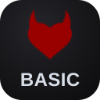

  

<h1 align="center">FL Tools Basic</h1>

<strong>Everyday Browsing, Kept Simple</strong>

  A focused FetLife companion with three browsing modes, direct profile actions, keyboard navigation, and bounded page loading.

  
  
  
  
  

## Install

  
  
  

## What FL Tools Basic Does

- Offers Standard, Clean, and SFW browsing modes with mode-owned filtering and media behavior.
- Adds conflict-aware shortcuts for modes, card navigation, opening a card, next page, and top.
- Remembers opened content, Events, Groups, and recently visited profiles per account.
- Adds loaded-page tools for Bookmarks and Requests while leaving native decisions under your control.
- Provides exact timestamps, banner hiding, picture navigation, shared-interest highlighting, visited links, and an undoable session mute.
- Provides bounded infinite scrolling with pause, retry, counts, and timed 5–60 minute pauses.
- Uses an open-book shortcut and terminology card with native FetLife shortcuts, gender codes, and abbreviations.
- Uses rounded rectangular controls, toggle switches, helper tips, shared appearance preferences, update notices, and built-in troubleshooting.
- Works alongside other installed FL Tools products while keeping shared settings.

## License

**Code, artwork, and documentation:** [All rights reserved](LICENSE)

## Disclaimer

FL Tools Basic is an independent project and is not affiliated with or endorsed by FetLife.
